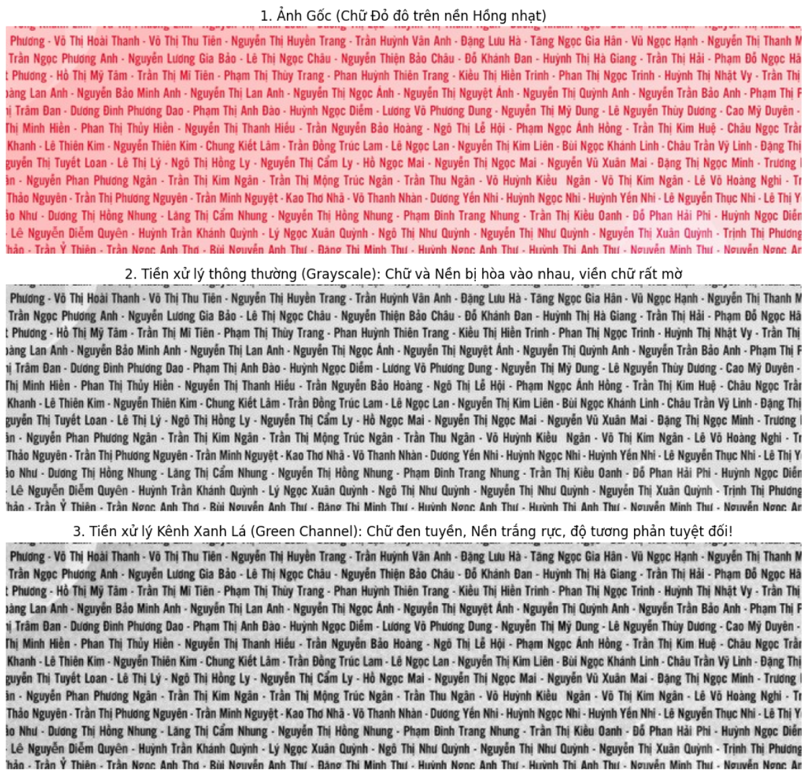

# Dense Name Highlighter (Trích xuất & Khoanh vùng Tên tự động)


## Giới thiệu (Overview)
**Dense Name Highlighter** là một công cụ Computer Vision mạnh mẽ giúp tự động tìm kiếm, định vị (bounding box) và highlight các chuỗi văn bản cụ thể (ví dụ: Tên học sinh/sinh viên) bên trong một bức ảnh chứa dữ liệu text dày đặc, lộn xộn, bị nhiễu hoặc có watermark chìm.

Project giải quyết triệt để các hạn chế của OCR truyền thống như:
- OCR đọc sai, thiếu nét, rớt dấu do ảnh mờ.
- OCR tự động gộp các từ lại với nhau (bỏ qua khoảng trắng hoặc dấu phân cách).
- OCR bị nhiễu bởi nền phức tạp (Background noise/Watermark).

## Các tính năng & Kỹ thuật cốt lõi (Key Features)

1. **Ensemble OCR (Gộp sức mạnh thị giác):** Thay vì chỉ chạy một luồng, hệ thống tạo ra 2 phiên bản tiền xử lý của ảnh (Grayscale và Green Channel) rồi cho AI quét cả hai. Việc này giúp tối đa hóa độ phủ (Recall), bắt được cả những tên mờ nhất.
2. **Channel Splitting & CLAHE (Xử lý nhiễu màu):**
   Tách riêng **Kênh Xanh Lá (Green Channel)** và áp dụng cân bằng sáng cục bộ (CLAHE). Kỹ thuật này triệt tiêu hoàn toàn nền màu sáng/hồng, biến chữ đỏ/tối thành màu đen tuyền để AI dễ dàng nhận diện.
3. **Fuzzy Regex Attention (Dò tìm mờ 1D):**
   Sử dụng thư viện `regex` để gióng hàng chuỗi cục bộ (Local Sequence Alignment). Thuật toán cho phép sai/dư/thiếu ký tự với **Dung sai động (Dynamic Tolerance)** dựa trên độ dài tên, giúp khóa mục tiêu chính xác kể cả khi OCR đọc nát bét.
4. **Proportional Bounding Box (Toán học nội suy tọa độ):**
   Tự động tính toán lại tỷ lệ điểm ảnh để vẽ khung highlight ôm sát sạt vào chữ cần tìm, hoàn toàn phớt lờ các rác OCR xung quanh.
5. **RapidFuzz Validation (Bộ lọc xác thực):**
   Lớp màng lọc cuối cùng chặn đứng các trường hợp False Positive (Bắt nhầm người).

## 📂 Cấu trúc dự án (Folder Structure)

```text
name_highlighter/
│
├── data/
│   ├── image.png         # Ảnh đầu vào chứa danh sách tên
│   └── names.txt         # Danh sách các tên mục tiêu cần tìm (mỗi tên 1 dòng)
│
├── output/
│   ├── final_crops/      # Thư mục chứa ảnh đã highlight riêng của từng người
│   └── final_highlighted.png # Ảnh tổng quan khoanh vùng toàn bộ mục tiêu
│
├── preprocessor.py       # Module tiền xử lý ảnh (CLAHE, Channel Splitting)
├── matcher.py            # Module thuật toán so khớp chuỗi (Fuzzy Regex)
├── ocr_engine.py         # Cấu hình PaddleOCR
├── utils.py              # Các hàm hỗ trợ chuẩn hóa text
└── main.py               # Nhạc trưởng điều phối toàn bộ Pipeline

```

## Cài đặt (Installation)

Yêu cầu môi trường có Python 3.8+ và khuyến nghị sử dụng GPU để OCR chạy mượt mà nhất.

```bash
# Cài đặt các thư viện lõi
pip install paddleocr paddlepaddle-gpu opencv-python rapidfuzz regex unidecode matplotlib

```

## 💻 Hướng dẫn sử dụng (Usage)

1. Đặt ảnh cần quét vào đường dẫn `data/image.png`.
2. Liệt kê các tên cần highlight vào file `data/names.txt`.
3. Chạy lệnh:

```bash
python main.py

```

Kết quả sẽ được xuất ra thư mục `output/`, bao gồm một ảnh tổng quan đánh dấu mọi người và các file ảnh cá nhân.

## Trực quan hóa: Sức mạnh của Tiền xử lý (Visualization)

Một trong những chìa khóa thành công của dự án là việc nhận ra hạn chế của ảnh Grayscale truyền thống và chuyển sang dùng **Green Channel**.



Như trên hình: Kênh màu xanh lá (Green Channel) hấp thụ ánh sáng đỏ của chữ và phản xạ ánh sáng trắng của nền, tạo ra độ tương phản (Contrast) cực đại giúp PaddleOCR "bắt" chữ chuẩn xác đến 99%.
